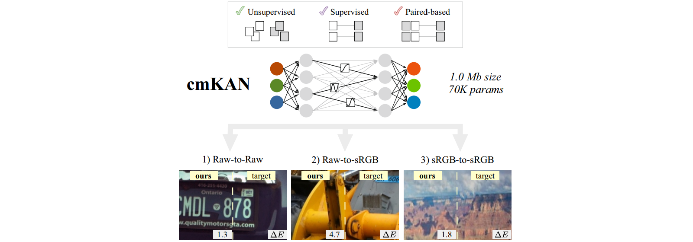

# Color Matching Using Hypernetwork-Based Kolmogorov-Arnold Networks

[{ width=400px }](figures/abstract.png)

### Abstract

We present ***cmKAN***, a versatile framework for color matching. Given an input image with colors from a source color distribution, our method effectively and accurately maps these colors to match a target color distribution in both **supervised** and **unsupervised** settings. Our framework leverages the spline capabilities of Kolmogorov-Arnold Networks (KANs) to model the color matching between source and target distributions. Specifically, we developed a hypernetwork that generates spatially varying weight maps to control the nonlinear splines of a KAN, enabling accurate color matching. As part of this work, we introduce a large-scale dataset of paired images captured by two distinct cameras to evaluate our method’s efficacy in matching colors produced by different cameras. We evaluated our approach across various color-matching tasks, including: (1) **raw-to-raw mapping**, where the source color distribution is in one camera’s raw color space and the target in another camera’s raw space; (2) **raw-to-sRGB mapping**, where the source color distribution is in a camera’s raw space and the target is in the display sRGB space, emulating the color rendering of a camera ISP; and (3) **sRGB-to-sRGB mapping**, where the goal is to transfer colors from a source sRGB space (e.g., produced by a source camera ISP) to a target sRGB space (e.g., from a different camera ISP). The results demonstrate that our method achieves state-of-the-art performance across these tasks while remaining lightweight compared to other color matching and transfer methods.

## Dataset

## How To Use
